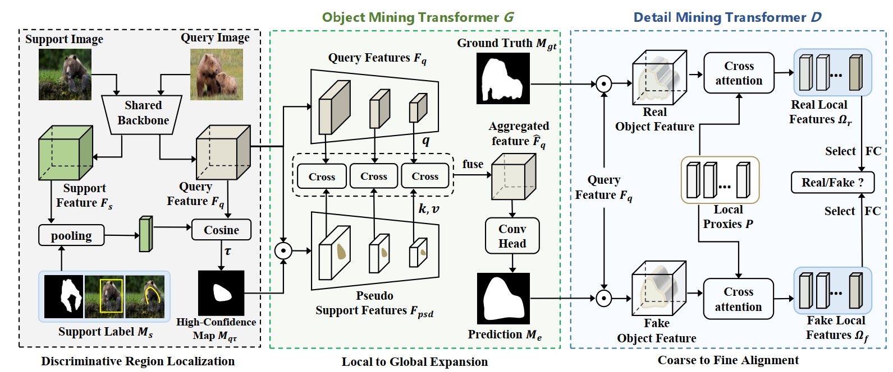

# AMNet
This is the official implementation for our NeurIPS 2023 paper "Focus on Query: Adversarial Mining Transformer for Few-Shot Segmentation".

<div align="center">

<h1>Focus on Query: Adversarial Mining Transformer for Few-Shot Segmentation </h1>

[Yuan Wang](https://scholar.google.com.hk/citations?user=Pge14mcAAAAJ&hl=zh-CN)<sup>1*</sup>, &nbsp; 
Naisong Luo<sup>1*</sup>, &nbsp; 
Tianzhu Zhang<sup>1📧</sup>, &nbsp;

<sup>1</sup>University of Science and Technology of China
</div>

## 🔍 Overview
<div align="center">

</div>

## 🗨 Description

Few-shot segmentation (FSS) aims to segment objects of new categories given only a handful of annotated samples. Previous works focus their efforts on exploring the support information while paying less attention to the mining of the critical query branch. In this paper, we rethink the importance of support information and propose a new query-centric FSS model Adversarial Mining Transformer (AMFormer), which achieves accurate query image segmentation with only rough support guidance or even weak support labels. The proposed AMFormer enjoys several merits. First, we design an object mining transformer (G) that can achieve the expansion of incomplete region activated by support clue, and a detail mining transformer (D) to discriminate the detailed local difference between the expanded mask and the ground truth. Second, we propose to train G and D via an adversarial process, where G is optimized to generate more accurate masks approaching ground truth to fool D. We conduct extensive experiments on commonly used Pascal-5i and COCO-20i benchmarks and achieve state-of-the-art results across all settings. In addition, the decent performance with weak support labels in our query-centric paradigm may inspire the development of more general FSS models.

## 🏗️ Environment
- python == 3.8.13
- torch == 1.7.1
- torchvision == 0.8.2
- timm == 0.5.4
- mmcv-full == 1.5.3
- mmsegmentation == 0.25.0
- opencv-python == 4.8.0.74

## 🖼️ Datasets
Please download the following datasets:

+ PASCAL-5<sup>i</sup>: [**PASCAL VOC 2012**](http://host.robots.ox.ac.uk/pascal/VOC/voc2012/) and [**SBD**](http://home.bharathh.info/pubs/codes/SBD/download.html)

+ COCO-20<sup>i</sup>: [**COCO 2014**](https://cocodataset.org/#download).

We follow the lists generation as [HDMNet](https://github.com/Pbihao/HDMNet/), and the file paths in the code need to be modificated according to the datasets and checkpoints. Here's an example:

      AMFormer/
      data/
      ├── base_annotation/           
      │   ├── coco/
      │   │   ├── val/
      │   │   └── train/
      |   |
      │   └── pascal/
      |       ├── val/
      │       └── train/
      |
      └── VOCdevkit2012
          ├── VOC2012/
          │   ├── JPEGImages/
          |   ├── Annotations/
          |   ├── ImageSets
          |   ├── SegmentationClassAug
          |   ├── SegmentationObject
          │   ├── SegmentationObjectAug/
          │   └── SegmentationClass
          |
          └──MSCOCO2014/
              ├── annotations/
              ├── train2014/
              └── val2014/


## Scripts
- First update the configurations in the `./config` for training or testing

- Train script
```
sh train.sh [exp_name] [dataset] [GPUs]

# Example (split0 | COCO dataset | 4 GPUs for traing):
# sh train.sh split0 coco 4
```
- Test script
```
sh test.sh [exp_name] [dataset] [GPUs]

# Example (split0 | COCO dataset | 1 GPU for testing):
# sh test.sh split0 coco 1
```

## 🖊️ Citation


If you find this project useful in your research, please consider cite:


```
@article{wang2024focus,
  title={Focus on query: Adversarial mining transformer for few-shot segmentation},
  author={Wang, Yuan and Luo, Naisong and Zhang, Tianzhu},
  journal={Advances in Neural Information Processing Systems},
  volume={36},
  year={2024}
}
```

## Acknowledgement
We primarily construct this repository based on [HDMNet](https://github.com/Pbihao/HDMNet/), with other outstanding projects, such as [BAM](https://github.com/chunbolang/BAM), [PFENet](https://github.com/dvlab-research/PFENet), [CyCTR](https://github.com/YanFangCS/CyCTR-Pytorch) also serving as important references for us.